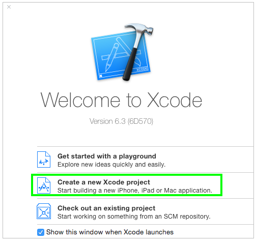
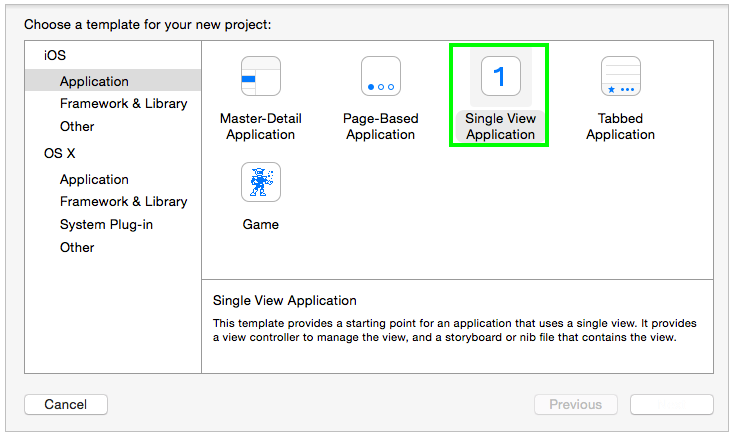
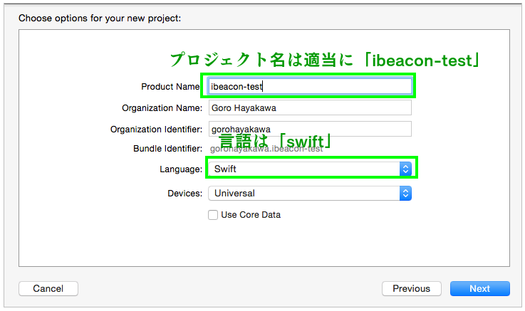
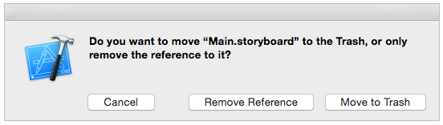
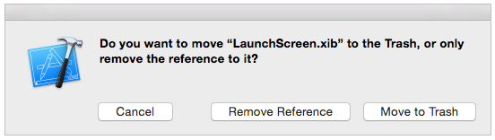
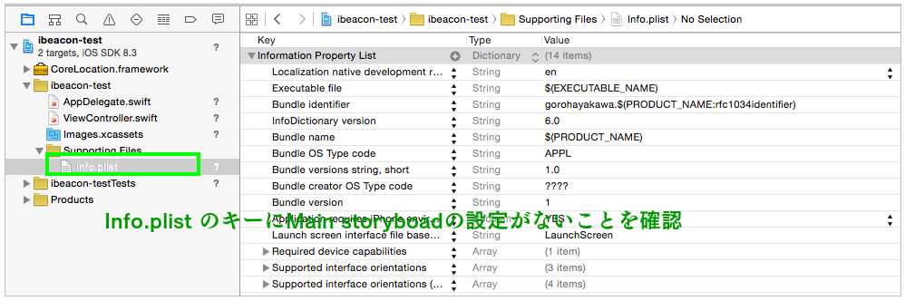

# ibeacon


こちらのサイトを参考
https://github.com/oggata/iBeaconDemo/blob/master/iBeaconDemo/ViewController.swift


### レポジトリの作成


### 作業ディレクトリの作成

```
$ cd ~/repos
$ git clone https://github.com/hayao56/ibeacon.git

$ cd ~/repos/ibeacon && mkdir -p app && mkdir -p server && cd $_
```

---

### ビーコンを準備

estimote社製ビーコンの場合はUUIDとして  
http://joris.kluivers.nl/blog/2013/09/27/playing-with-ibeacon/  
”B9407F30-F5F8-466E-AFF9-25556B57FE6D”  
を使用すればOK。

ビーコンをMacで代用する場合、Bluetooth 4.0に対応しているか確認

このMacについての情報を参考に
型番をネットで検索、「MacBook Pro (13-inch, Mid 2012) 」のAppleの技術仕様を確認  
https://support.apple.com/kb/SP649?locale=ja_JP&viewlocale=ja_JP  

>ワイヤレス
802.11n Wi-Fiワイヤレスネットワーク接続3、IEEE 802.11a/b/gに対応
Bluetooth 4.0ワイヤレステクノロジー


### Macでビーコンを作る

node.jsをMacにダウンロード+インストール  
```
$ node -v
v0.10.31

$ cd ~/repos/ibeacon && mkdir -p server && cd $_ && mkdir -p node_modules
```

```
$ npm install bleacon

Dev-MBP-001:server g-hayakawa$ npm install bleacon

> bignum@0.9.2 install /Users/g-hayakawa/repos/ibeacon/server/node_modules/bleacon/node_modules/bignum
> node-gyp configure build

\
  CXX(target) Release/obj.target/bignum/bignum.o
  SOLINK_MODULE(target) Release/bignum.node
  SOLINK_MODULE(target) Release/bignum.node: Finished

> xpc-connection@0.1.3 install /Users/g-hayakawa/repos/ibeacon/server/node_modules/bleacon/node_modules/bleno/node_modules/xpc-connection
> node-gyp rebuild

  CXX(target) Release/obj.target/binding/src/XpcConnection.o
  SOLINK_MODULE(target) Release/binding.node
  SOLINK_MODULE(target) Release/binding.node: Finished

> xpc-connection@0.1.3 install /Users/g-hayakawa/repos/ibeacon/server/node_modules/bleacon/node_modules/noble/node_modules/xpc-connection
> node-gyp rebuild

  CXX(target) Release/obj.target/binding/src/XpcConnection.o
  SOLINK_MODULE(target) Release/binding.node
  SOLINK_MODULE(target) Release/binding.node: Finished

> bleno@0.1.12 install /Users/g-hayakawa/repos/ibeacon/server/node_modules/bleacon/node_modules/bleno
> node-gyp rebuild

  LINK(target) Release/hci-ble
  LINK(target) Release/hci-ble: Finished
  LINK(target) Release/l2cap-ble
  LINK(target) Release/l2cap-ble: Finished

> noble@0.3.14 install /Users/g-hayakawa/repos/ibeacon/server/node_modules/bleacon/node_modules/noble
> node-gyp rebuild

  LINK(target) Release/hci-ble
  LINK(target) Release/hci-ble: Finished
  LINK(target) Release/l2cap-ble
  LINK(target) Release/l2cap-ble: Finished
bleacon@0.2.2 node_modules/bleacon
├── debug@0.7.4
├── bignum@0.9.2 (nan@1.6.2)
├── bleno@0.1.12 (xpc-connection@0.1.3)
└── noble@0.3.14 (bplist-parser@0.0.6, xpc-connection@0.1.3)
```

```
$ vim beacon.js
```

```
var Bleacon = require('bleacon');
var uuid = 'AAAAAAAAAAAAAAAAAAAAAAAAAAAAAAAA';
var major = 0;
var minor = 0;
var measuredPower = -59;
Bleacon.startAdvertising(uuid, major, minor, measuredPower);
```

### ビーコンを発信する

```
node beacon.js
```


### 受信機を作成する

XCodeを起動し、新規プロジェクト作成。




SingleView Applicationを選択します。





### iOSデバイス（iPhone・iPad）実機テストの設定

このあたりを参考に
http://r-dimension.xsrv.jp/classes_j/ios_test/

1. キーチェーンアクセスでの証明書要求
2. 証明書の発行
3. キーチェーアクセスでの証明書の登録

### CoreLocation.framework の追加

CoreLocationフレームワークには、測位（現在地を算出すること）に関する一通りの機能がそろっています。iPhone／iPad／iPod touchには、GPSや携帯電話基地局、WiFiアクセスポイントを使った現在地を取得する機能があります（実際に、どの機能を利用して測位するかは、機種によります）。

CoreLocation.frameworkを読み込みます。
BuildPurchase->LinkBinaryWithLibraries->+


### main.storyboard の削除


Move to Trash


### LaunchScreen.xlb の削除


Move to Trash

### Info.plist の編集



「Main storyboard file base name」がある場合は削除


### Label の追加

ViewController.swift の編集

```
import UIKit

class ViewController: UIViewController {

    override func viewDidLoad() {
        super.viewDidLoad()
        // Do any additional setup after loading the view, typically from a nib.

        // ラベルの追加
        let myLabel = UILabel()
        myLabel.frame = CGRectMake(0,0,300,100)
        myLabel.layer.position = CGPoint(x: self.view.bounds.width/2, y: 200)
        myLabel.backgroundColor = UIColor.orangeColor()
        myLabel.text = "Hello, iBeacon!"
        myLabel.font = UIFont.systemFontOfSize(40)
        myLabel.textColor = UIColor.whiteColor()
        myLabel.textAlignment = NSTextAlignment.Center
        self.view.addSubview(myLabel)

    }

    override func didReceiveMemoryWarning() {
        super.didReceiveMemoryWarning()
        // Dispose of any resources that can be recreated.
    }
}
```

AppDelegate.swift の編集

```
class AppDelegate: UIResponder, UIApplicationDelegate {

    var window: UIWindow?

    func application(application: UIApplication, didFinishLaunchingWithOptions launchOptions: [NSObject: AnyObject]?) -> Bool {
        // Override point for customization after application launch.

        // ルートビューコントローラの指定
        self.window = UIWindow(frame: UIScreen.mainScreen().bounds)
        let viewController = ViewController()
        self.window!.rootViewController = viewController

        // ウィンドウの設定
        self.window!.backgroundColor = UIColor.whiteColor()
        self.window!.makeKeyAndVisible()
        return true
    }
```


/Users/g-hayakawa/repos/ibeacon/app/ibeacon-test/ibeacon-test/ViewController.swift:174:10: Objective-C method 'locationManager:didRangeBeacons:inRegion:' provided by method 'locationManager(_:didRangeBeacons:inRegion:)' conflicts with optional requirement method 'locationManager(_:didRangeBeacons:inRegion:)' in protocol 'CLLocationManagerDelegate'


/Users/g-hayakawa/repos/ibeacon/app/ibeacon-test/ibeacon-test/ViewController.swift:13:7: Class 'ViewController' has no initializers


/Users/g-hayakawa/repos/ibeacon/app/ibeacon-test/ibeacon-test/ViewController.swift:143:40: Missing argument label 'stringInterpolationSegment:' in call
